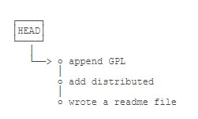
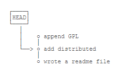
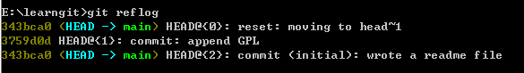
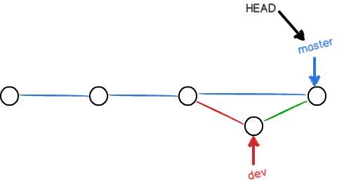
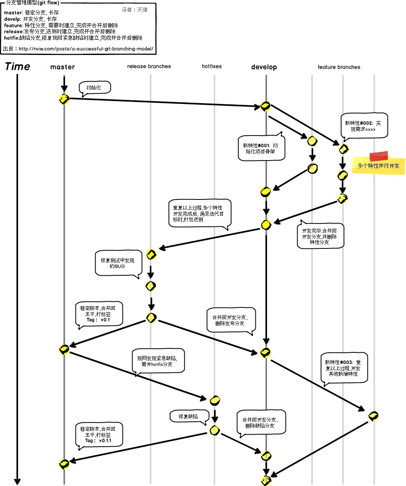

## git(version 2.30.0.windows.1)学习笔记
----

1. **git 基本上传文件操作步骤**  

    - 创建需要上传的文件，然后执行以下操作  
   
    - `git init`
      
    - `git add <file>`   
     
    - `git commit -m <message>("this is the description of this commit")`  

2. **git 版本回退**
    
    - 我们可以使用 `git log --pretty=oneline` 查看该git库提交历史。
    
    - `git reset --hard head~n` 用来执行回退操作，n代表回退的步长

      
    

    - 使用 `git reflog` 来查看该git库的提交命令历史，通过确定`commit_id`来确认需要回退的版本id

      

    - 因为有head指针，所以回退速度很快；对于已经上传到远程库的如果想做改动如(A->B->C，现在想回到B，那么只能做一个B的快照变为A->B->C->B，不能直接到B然后强行删除C`git push -f`(除非是个人项目))，只能在本地先做改动之后再执行如下命令。
    - `git pull`
   
    - `git push`
 
3. **工作区和暂存区**  

    
    
    - 工作区就是电脑本地能看到的目录,包括隐藏目录`.git`，暂存区是暂时存放的已修改文件。
    
    - `git add` 实际上就是将文件修改添加到暂存区;`git commit`就是将暂存区的所有内容提交到当前分支。
    
    - 利用 `git status` 查看现有的文件是否被修改或是新创建的文件。
    
      
    
    - `git diff` 比较工作区(work dict)和暂存区(stage)区域快照之间的差异，只显示已修改但尚未暂存的改动，即执行`git add`后该差异就会消失。
    
    - `git diff --cached`是暂存区(stage)和分支(branch)的比较。

4. **管理修改和撤销修改**
   
    - Git跟踪管理的是文件修改，而非文件本身。
    
    - 若只修改了文件内容而未执行`git add`命令，那么执行`git commit -m <message>`时并不会提交修改，因为没有执行`git add`的内容不会上传到暂存区，而只有上传到暂存区的内容才会被提交。对于多个需要上传的内容可以先全部执行`git add`后再执行`git commit -m  <message> 进行一次性上传`
    
    - 未保存到暂存区的文件可以执行`git restore <filename>`来撤销修改。

    - `git restore --worktree <filename>`从暂存区(stage)恢复到工作区(work dict)。

    - `git restore --staged <filename>`从master恢复到暂存区。

    - `git restore --soure=head --staged --worktree <filename>`从master恢复到暂存区和工作区。

5. **删除文件**

    - 对于已经提交到`branch`的文件，若只在工作区删除了文件可以通过4的命令来从暂存区或者branch恢复到工作区。

    - 如果已经执行了`git rm <filename>`即在暂存区删除了该文件，那么可以通过执行`git reset --hard head~`来回退版本号。

6. **建立远程库**

    - 首先在github上创建一个新的repository，然后通过`git remote origin git@github.com:xx/xx.git`与远程库建立联系，如果github库输入错误的话，需要执行`git remote rm origin`，然后再重新建立联系；可以使用`git remote -v`查看远程库信息。
    
    - `git pull --rebase origin <branch>`，当本地库和远程库不一致时需要先执行`pull`命令将远程库不一致的内容拷贝到本地，使用`git branch`可以查看本地branch的名字。

    - `git push -u origin <branch>`，将本地的`main`分支的内容上传到远程库`master`分支，参数`-u`能使两者关联起来以简化以后的命令。

7. **ssh-key的创建**

    - 在`git-bash`中执行`ssh-keygen -t rsa -C "youremail"`，然后执行`cat ~/.ssh/id_rsa.pub`，复制内容粘贴,然后打开`github/settings/SSH and GPG keys`新建一个`ssh`并粘贴。

    - 使用`ssh -T git@github.com`进行测试。

8. **远程库克隆**

    - `git clone git@github.com:xxxx/xxx.git`，git支持多种协议，其中`ssh`协议的速度最快，`https`协议速度最慢。

9. **创建与合并分支**

    - `git branch <branchname>`，创建新的分支。

    - `git checkout/switch <branchname>`，切换到新分支，使用`switch`操作更容易让人理解。

    - `git switch -c <branch>|git checkout -b <branchname>`，创建并切换新分支。

    - `git merge <designated branchname>`，我们在某个分支下进行的修改在另一个分支下是不可见的，可以通过`merger`操作来实现分支合并，最后删除我们创建的分支。

    - `git branch -d <branchname>`，删除分支。

    - 尽量使用创建新的分支来完成工作任务，最终再进行合并并删除分支，这与直接在`maste`分支上完成是一样的效果，但过程更安全。

10. **解决冲突**

    - 当两个分支同时对一个文件进行更新时，若更新内容不一致，则在进行`merger`操作时就会出现冲突，可以利用指令`git log --pretty=oneline`查看操作历史，利用`git log --graph --pretty=online --abbrev-commit`查看分支合并图，分支图谱从上到下的时间线是从新到旧。

11. **分支管理策略**

    - `git`的`Fast forword`模式，我们称这个模式为“快进模式”，直接将`master`指向`dev`的当前提交，这种合并方式在删除分支后会丢失分支信息；所以我们会用`--no-ff`模式来合并分支

    

    - `master`分支应该十分稳定，即仅用来发布新版本而不在上面干活，干活都在`dev`分支上干活

    

    - 在利用`git`进行工作时实际上应该先执行`pull`拉取服务器上的内容然后再此基础上提交自己的更新再上传到服务器。

12. **Bug 分支**

    - 当我们在做自己的开发时，突然接到需求要修复一个`bug`，此时我们需要利用`git stash`来保存当前的工作现场。可以利用`git stash list`查看保存的现场，`git stash apply`恢复，恢复后，`stash`的内容并不会被删除，需要利用`git stash drop`来删除；上面的两个命令可以用`git stash pop`替代，即在恢复后删除`stash`的内容。

    - 如果`stash`中有多个记录 那么可以在恢复时指定`git stash apply stash@{n}`。

    - 我们知道此时的`dev`分支上也应该有该`bug`，我们查看刚刚提交`bug`的`commit_id`，然后执行`git cherry-pick commit_id`来修复分支`dev`的`bug`，而不是再切换到`dev`分支做重复劳动。

13. **feature 分支**

    - `git branch -D <branchname>`强行删除一个分支。

14. **多人协作**

    

    - 远程仓库的默认名是`origin`，查看远程库信息`git remote -v`。

    - 推送分支`git push origin master`，将本地master分支上的所有内容推送到远程库。

    - `git checkout -b dev origin/dev`，创建远程库的dev分支到本地。

    - 当多人对origin/dev做了修改后，在进行push操作之前要先将代码pull到本地再进行合并然后提交。

    - `git branch --set-upstream-to=origin/dev dev`，将本地`dev`与远程`origin/dev`进行连接。
    
	- 1.首先，可以试图用`git push origin <branch-name>`推送自己的修改；

	- 2.如果推送失败，则因为远程分支比你的本地更新，需要先用`git pull`试图合并；

	- 3.如果合并有冲突，则解决冲突，并在本地提交；

	- 4.没有冲突或者解决掉冲突后，再用`git push origin <branch-name>`推送就能成功！

	- 5.如果`git pull`提示`no tracking information`，则说明本地分支和远程分支的链接关系没有创建，用命令`git branch --set-upstream-to <branch-name> origin/<branch-name>`。

15. **Rebase**

	- `git rebase`。

    - 可以把本地未`push`分叉提交历史整理成直线。

    - rebase的目的是使我们在查看历史提交变化时容易，因为分叉的提交需要三方对比(本地、远程、别人)。

16. **标签管理**

    - `git tag <tag-name>`可以打新标签，默认是打在最新提交的`commit`上的，如果需要之前的打标签可以通过`git log`查看其`commit_id`，然后执行`git tag <tag-name> commit_id`。

    - `git tag`查看所有标签，`git show <tag-name>`查看标签详细信息。

	- `git tag -a <tag-name> -m <message>`，创建带说明的标签。

	- `git tag -d <tag-name>`，删除标签。

	- `git push origin <tag-name>`，将标签推送到远程库。

	- `git push origin --tags`，一次性推送尚未推送到远程的所有标签。

	- `git push oritin:refs/tags/<tag-name>`，删除推送到远程库的`tag`。

